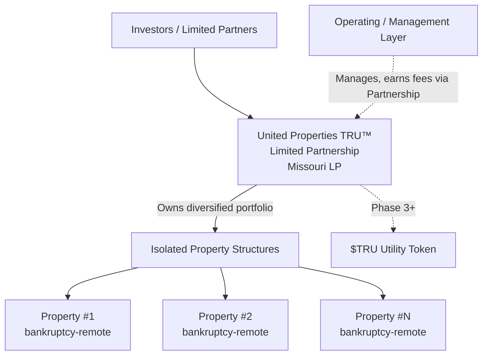

# Corporate Structure

## Entity Architecture

United Properties TRU™ operates through a purpose-designed structure in which investors buy into a single entity — **United Properties TRU™ Limited Partnership** (the Partnership) — that holds a diversified portfolio of properties, while each individual property is held in its own isolated legal structure for risk protection. The architecture is designed to be scalable, compliant, and resilient.

:::info Risk Isolation
Each property is held in its own isolated, bankruptcy-remote structure, so a problem with one property does not affect the others or the Partnership. Investors' economic interest is diversified across the whole portfolio through the Partnership.
:::

---

## Entity Summary

| Entity | Purpose | Owned / Controlled By |
|---|---|---|
| United Properties TRU™ Limited Partnership | The entity investors buy into; holds the diversified property portfolio and earns platform fees; distributes rent to LPs | Limited Partners (investors) + Managing General Partner |
| Operating / Management Layer | Technology, IP, brand; provides management services to the Partnership | Founders, team, Managing General Partner |
| Isolated Property Structures | Each holds title to one property in a bankruptcy-remote compartment, feeding its economics to the portfolio | Held for the Partnership / the portfolio |
| $TRU Utility Token (Phase 3+) | Separate utility token for fee discounts, access tiers, and governance only | Established only at token launch |

---

## United Properties TRU™ Limited Partnership — The Entity Investors Buy Into

The Partnership (a Missouri limited partnership) is the entity investors buy into. It:

- Holds the diversified portfolio of properties (through the isolated property structures described below)
- Earns all platform fees at origination, tokenization, ongoing management, disposition, and secondary transfer
- Distributes rental income pro-rata to Limited Partners in USDC or fiat
- Is the issuer of the Limited Partnership interests and (in Phase 2+) the UPTRU property tokens that represent a diversified interest in the whole portfolio

Investors acquire **Limited Partnership (LP) interests** / pre-assigned property-token allocations in the Partnership and thereby own a share of the whole portfolio — not any individual property. A Managing General Partner controls and administers the Partnership.

---

## Operating / Management Layer

A separate operating/management layer holds the technology, software, intellectual property, and brand assets, and provides management services to the Partnership. It supports platform operations but is **not** the entity investors buy into and does not itself own the portfolio — the Partnership earns the fees and owns the portfolio. This separation keeps day-to-day operating risk distinct from the assets held for investors.

---

## Isolated Property Structures — Per-Property Ring-Fencing

Each property brought onto the platform is placed in its own dedicated, isolated legal structure that holds legal title to that single property. The economic interest in every property flows into the single portfolio held through the Partnership.

Key characteristics:

- **One property per structure** — Each structure holds exactly one property, providing clean bankruptcy-remote isolation between assets
- **Isolation** — A problem with one property does not reach any other property or the Partnership as a whole
- **Diversified interest (Phase 2+)** — ERC-3643 UPTRU tokens are minted into a single shared pool as properties are added; holders own a diversified interest across the whole portfolio in proportion to their holdings
- **Distributions** — Rental income across all properties is distributed through the Partnership to LP / token holders pro-rata, in USDC or fiat, on a monthly or quarterly schedule
- **Scalability** — A new property structure can be added at low marginal cost, without changing what investors own (a share of the whole growing portfolio)

---

## $TRU Utility Token — Phase 3 and Beyond

The platform contemplates the future launch of a separate platform **utility** token, $TRU. It is distinct from the Partnership, from the UPTRU property/security token, and from all property structures.

$TRU:

- Is established only at the time of the Token Generation Event (TGE)
- Does not hold title to any property and does not distribute rental income
- Provides fee discounts, access tiers, and governance participation only — it does not represent ownership in any property or carry any right to rental income or profit share

$TRU is described here for completeness. Its launch is contingent on a future decision point in the roadmap.
