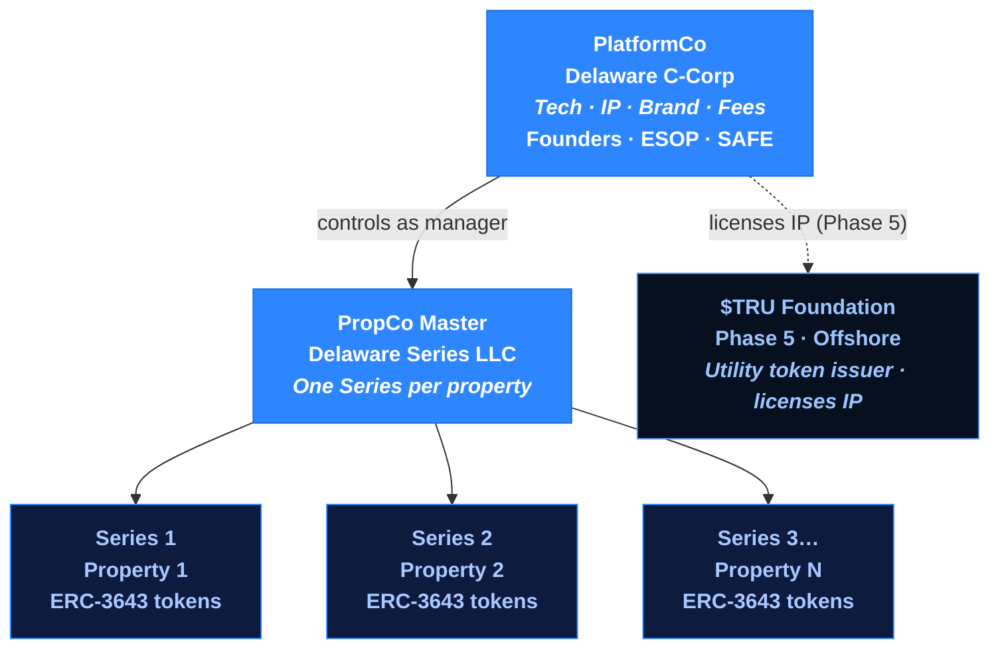

# Corporate Structure

United Properties TRU™ uses a purpose-built legal architecture designed to isolate risk, enable scalable property tokenization, and support a regulated securities offering.

## Entity Overview

## Entity Details

### PlatformCo — Delaware C-Corp

| Attribute | Detail |
|---|---|
| Type | Delaware C-Corp |
| Purpose | Holds all technology, IP, brand, contracts, and fee revenue |
| Owned by | Founders, team (ESOP), SAFE investors |
| Revenue | All platform fees (origination, tokenization, asset management, disposition, secondary transfer) |
| Role | Sole manager of PropCo Master and every property series |

PlatformCo is the operating entity. It earns all platform fees. Investors in PlatformCo (via SAFE) own equity in the fee-generating business — not in any specific property.

### PropCo Master — Delaware Series LLC

| Attribute | Detail |
|---|---|
| Type | Delaware Series LLC |
| Purpose | Master legal shell that spawns one Series per property |
| Managed by | PlatformCo |
| Cost per new Series | Near-zero (no separate incorporation needed) |

PropCo Master itself holds no assets. Its value is as the organizational container for property-specific Series.

### Property-Specific Series (Series 1, 2, 3 …)

| Attribute | Detail |
|---|---|
| Type | Series under PropCo Master |
| Purpose | Holds title to exactly one property |
| Bankruptcy remoteness | Yes — each Series' assets and liabilities are legally isolated |
| Token issuance | Issues ERC-3643 property tokens to investors |
| PlatformCo stake | 2–5% GP stake retained by PlatformCo |

Each property series is **bankruptcy-remote**: if one property fails, it cannot expose other series or PlatformCo to liability.

### $TRU Foundation (Phase 5 — Offshore)

Established in Phase 5 as the issuer of the $TRU utility token. Licenses the TRU™ brand and platform IP from PlatformCo. Structure and jurisdiction to be determined with legal counsel at token launch.

## Risk Isolation

The two-entity design means:

- **Property risk stays in each Series.** A bad property cannot harm other properties or PlatformCo.
- **Platform risk stays in PlatformCo.** Platform difficulties cannot access property-held assets.
- **Cross-contamination is structurally prevented** by the Series LLC ring-fencing.

## The $200k SAFE Financing

Phase 0 capital is raised into PlatformCo via:

- **Post-money SAFE** — standard YC template, $2–3M valuation cap (to be set), no discount
- **Token warrant side letter** — each SAFE investor receives pro-rata rights to future $TRU supply at TGE (no tokens issued today)
- **Identical terms** for all Phase 0/1 investors — no per-investor negotiation
- **Non-dilutive investor perks:**
  - 0% origination fee on their own property investments
  - First-allocation rights on new property listings
  - Pro-rata rights in the next equity round
