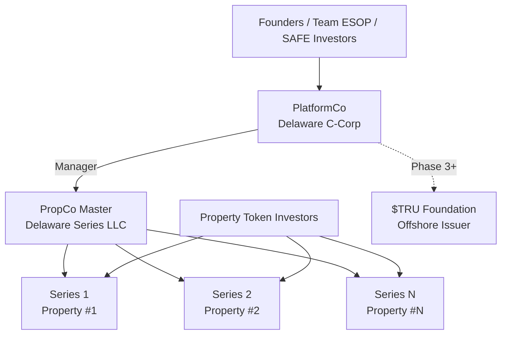

# Corporate Structure

## Entity Architecture

United Properties TRU™ operates through a purpose-designed multi-entity structure that separates platform operations from property ownership and isolates each property from every other property. The architecture is built on Delaware law and is designed to be scalable, compliant, and resilient.

:::info Risk Isolation
Property risk stays inside each series; platform risk stays inside PlatformCo. If either fails, the other survives.
:::

---

## Entity Summary

| Entity | Purpose | Owned / Controlled By |
|---|---|---|
| PlatformCo (DE C-Corp) | Technology, IP, brand; manager of every series; earns all platform fees | Founders, team (ESOP), SAFE investors |
| PropCo Master (DE Series LLC) | Legal shell that spawns one bankruptcy-remote series per property | Controlled by PlatformCo as manager |
| Series 1, 2, 3… | Holds title to one property; issues ERC-3643 tokens as its units | Property token investors (+ optional 2–5% PlatformCo GP stake) |
| $TRU Foundation (Phase 3+) | Offshore issuer of the platform utility token; licenses IP from PlatformCo | Established only at token launch |

---

## PlatformCo — Delaware C-Corporation

PlatformCo is the operating entity of the platform. It holds:

- All technology and software assets
- All intellectual property and brand assets
- All fee contracts with each property series
- The manager role over PropCo Master and, by extension, over every series created within it

PlatformCo earns revenue through fees charged to each property series at origination, tokenization, ongoing management, disposition, and secondary transfer. All platform-level commercial activity flows through PlatformCo.

PlatformCo is the entity into which early-stage investment capital is raised. Equity holders of PlatformCo (founders, team ESOP, and SAFE investors) participate in the growth of the platform business — not in the assets of any individual property series.

---

## PropCo Master — Delaware Series LLC

PropCo Master is a single Delaware Series LLC that serves as the legal container for all property series. It is managed by PlatformCo.

The Series LLC structure under Delaware law allows PropCo Master to create an unlimited number of internally isolated series, each with its own assets, liabilities, members, and operating terms. Each series is legally ring-fenced from all other series within the same master LLC.

Key characteristics:

- **Scalability** — A new series can be created for each property at near-zero marginal cost, without requiring a separate entity formation
- **Isolation** — Creditors of one series have no legal claim against the assets of any other series
- **Management** — PlatformCo serves as manager of PropCo Master and, through it, as manager of every individual series

---

## Series 1, 2, 3… — Per-Property Series

Each property brought onto the platform is assigned to its own dedicated series within PropCo Master. The series holds legal title to the property and is the issuing entity for the ERC-3643 tokens that represent membership interests in that series.

Key characteristics:

- **One property per series** — Each series holds exactly one property, providing clean legal isolation between assets
- **Token issuance (Phase 2+)** — The series issues ERC-3643 permissioned tokens as its membership units in the on-chain phase; token holders hold interests in proportion to their token holdings
- **Distributions** — Rental income is distributed from the series through the Partnership to LP holders pro-rata, in USDC or fiat, on a monthly or quarterly schedule
- **LP participation** — Investors participate at the Partnership level, owning a share of the overall portfolio — not through direct per-series token ownership in the current LP offering phase

---

## $TRU Foundation — Phase 3 and Beyond

The platform contemplates the future establishment of a separate offshore foundation to serve as the issuer of the platform utility token. This entity is distinct from PlatformCo and from all property series.

The $TRU Foundation:

- Licenses intellectual property from PlatformCo
- Is established only at the time of the Token Generation Event (TGE)
- Does not hold title to any property and does not distribute rental income
- The platform utility token, if launched, provides fee discounts, access tiers, and governance participation only — it does not represent ownership in any property or carry any right to rental income or profit share

The $TRU Foundation is described here for completeness of the entity architecture. Its formation and the associated token launch are contingent on a future decision point in the roadmap.
