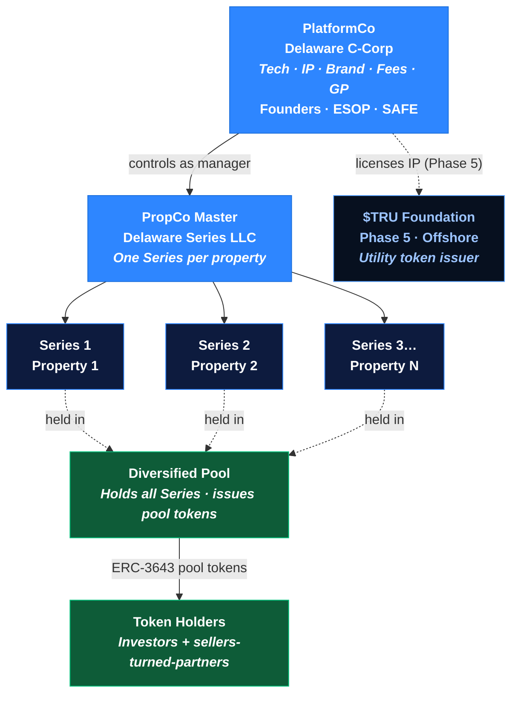

# Corporate Structure

United Properties TRU™ uses a purpose-built legal architecture designed to isolate risk per property, aggregate many properties into a **diversified pool**, and support a regulated securities offering.

## Entity Overview

## Entity Details

### PlatformCo — Delaware C-Corp

| Attribute | Detail |
|---|---|
| Type | Delaware C-Corp |
| Purpose | Holds all technology, IP, brand, contracts, and fee revenue; acts as platform GP |
| Owned by | Founders, team (ESOP), SAFE investors (LP interests) |
| Revenue | All platform fees (origination, tokenization, asset management, disposition, secondary transfer) |
| Role | Sole manager of PropCo Master, the pool, and every property series |

PlatformCo is the operating entity and **general partner**. It earns all platform fees and owns the platform's intellectual property and trade secrets. Investors in PlatformCo (via SAFE / LP interests) own equity in the fee-generating business — not in any specific property.

### PropCo Master — Delaware Series LLC

| Attribute | Detail |
|---|---|
| Type | Delaware Series LLC |
| Purpose | Master legal shell that spawns one Series per acquired property |
| Managed by | PlatformCo |
| Cost per new Series | Near-zero (no separate incorporation needed) |

### Property-Specific Series (Series 1, 2, 3 …)

| Attribute | Detail |
|---|---|
| Type | Series under PropCo Master |
| Purpose | Holds title to exactly one property |
| Bankruptcy remoteness | Yes — each Series' assets and liabilities are legally isolated |
| Role | Contributes its income and value into the diversified pool |

Each property series is **bankruptcy-remote**: if one property fails, it cannot expose other series, the pool, or PlatformCo to liability.

### Diversified Pool

| Attribute | Detail |
|---|---|
| Purpose | Aggregates all property Series into one diversified portfolio |
| Token issuance | Issues ERC-3643 pool tokens to investors and sellers-turned-partners |
| What holders own | A pro-rata interest in the **whole portfolio**, not a single Series |
| Why it exists | Delivers diversification, low minimums, and a single liquid instrument |

The pool is the layer that makes a token a **diversified** position. Per-property risk stays ring-fenced in each Series underneath; investors hold an interest in the aggregated pool above.

### $TRU Foundation (Phase 5 — Offshore)

Established in Phase 5 as the issuer of the $TRU utility token. Licenses the TRU™ brand and platform IP from PlatformCo. Structure and jurisdiction to be determined with legal counsel at token launch.

PlatformCo

Delaware C-Corp · GP

Holds IP & trade secrets · earns all fees

Series (1…N)

Delaware Series LLC

One property each · bankruptcy-remote

Diversified Pool

Holds all Series

Issues ERC-3643 pool tokens

<strong style="color:#5ba4ff">Risk Isolation + Diversification:</strong> Each property is ring-fenced in its own Series, so one default can't harm the others — while the pool above gives every token holder diversified exposure to all of them.

## How Sellers Enter the Structure

When a property owner sells into the platform, their property is placed into a new Series under PropCo Master and added to the pool. In exchange they receive **pool tokens** (and/or cash). A seller who takes tokens becomes a **partner** in the diversified portfolio — continuing to participate in income and appreciation across every property in the pool, not just the one they contributed.

## Risk Isolation

The design means:

- **Property risk stays in each Series.** A bad property cannot harm other properties, the pool, or PlatformCo.
- **Platform risk stays in PlatformCo.** Platform difficulties cannot access property-held assets.
- **Cross-contamination is structurally prevented** by the Series LLC ring-fencing — even though investors hold a single, diversified pool token.

## The $200k SAFE Financing

Phase 0 capital is raised into PlatformCo via:

- **Post-money SAFE** — standard YC template, $2–3M valuation cap (to be set), no discount. These are the platform's **LP interests** (equity in the fee-earning operating company that owns the business model, IP and trade secrets).
- **Token warrant side letter** — each SAFE investor receives pro-rata rights to future $TRU supply at TGE (no tokens issued today)
- **Identical terms** for all Phase 0/1 investors — no per-investor negotiation
- **Non-dilutive investor perks:**
  - 0% origination fee on their own property investments
  - First-allocation rights on new property listings
  - Pro-rata rights in the next equity round
