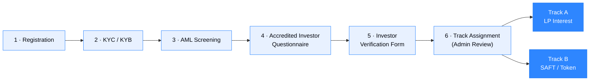
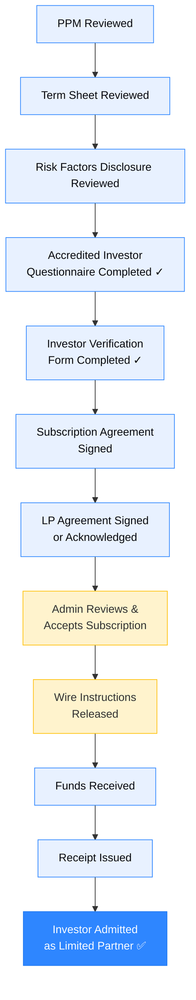

# Investor Onboarding

United Properties TRU™ supports two distinct offering tracks. After a shared compliance intake process, each investor is assigned to the correct track based on the nature of their investment.

---

## The Two Offering Tracks

| Track | Instrument | Investor Type |
|---|---|---|
| **Track A — LP Interest** | Limited Partnership Interests (PPM + Subscription Agreement) | Investors seeking equity participation in the LP under Reg D |
| **Track B — Security Token / SAFT** | Future Security Token / SAFT instrument | Investors seeking token rights with future conversion |

:::info Current Active Track
Track A (LP Interest Offering) is currently active. Track B (Security Token / SAFT) is available for investors who qualify and select that offering. Wire instructions are not released until admin review and subscription acceptance are complete for either track.
:::

---

## Phase 1 — Shared Compliance Intake (All Investors)

All investors complete a single shared compliance intake regardless of which offering track they are pursuing.

### Step 1 — Registration

- Full legal name
- Email address and password
- Country of residence
- Investor type (individual or entity)

### Step 2 — KYC / KYB

**Individual investors (KYC):**
- Government-issued photo ID (passport or driver's license)
- Selfie / liveness check
- Address verification

**Entity investors (KYB):**
- Entity formation documents
- Ownership structure / beneficial owner declarations
- Authorized signatory verification

### Step 3 — AML Screening

Automated screening against global watchlists, sanctions lists, and PEP (Politically Exposed Persons) databases via third-party provider (Sumsub or Persona). AML flags escalate to admin review.

### Step 4 — Accredited Investor Questionnaire

Investors complete the Accredited Investor Questionnaire to establish eligibility under Regulation D:

- **Income path:** $200k+ individual / $300k+ joint for last two years with reasonable expectation of continuation
- **Net worth path:** $1M+ net worth excluding primary residence
- **Professional certification path:** Active Series 7, 65, or 82 license; registered investment adviser

### Step 5 — Investor Verification Form

Supporting documentation submitted to verify accredited investor status (tax returns, financial statements, CPA/attorney letter, or license verification).

### Step 6 — Track Assignment (Admin Review)

The admin team reviews the complete compliance submission before assigning the investor to a track. **No offering documents, wire instructions, or signing documents are released until this step is complete.**

---

## Track A — LP Interest Investor

Investors in Track A are participating in the private placement of Limited Partnership Interests in United Properties TRU™ Limited Partnership under the PPM.

### Track A Document Checklist

| # | Milestone | Status Control |
|---|---|---|
| 1 | Private Placement Memorandum (PPM) reviewed and acknowledged | Investor |
| 2 | Term Sheet reviewed and acknowledged | Investor |
| 3 | Risk Factors Disclosure reviewed and acknowledged | Investor |
| 4 | Accredited Investor Questionnaire completed | Investor (from compliance intake) |
| 5 | Investor Verification Form completed | Investor (from compliance intake) |
| 6 | Subscription Agreement signed | Investor (e-signature) |
| 7 | LP Agreement signed or acknowledged | Investor (e-signature) |
| 8 | **Admin reviews and accepts subscription** | **Admin gate — required before wire instructions** |
| 9 | **Wire instructions released to investor** | **Admin action — only after step 8** |
| 10 | Funds received and confirmed | Admin confirms receipt |
| 11 | Conditional Receipt of Funds issued to investor | Admin |
| 12 | Investor admitted as Limited Partner; records updated | Admin |

:::warning Wire Instructions Gate
Wire instructions are not released to any investor until the admin team has reviewed the full subscription package and formally accepted the subscription. This gate is non-negotiable.
:::

### Track A — Admin Review Checklist (Internal)

Before accepting a subscription and releasing wire instructions, admin must confirm:

- [ ] KYC/KYB passed (third-party provider confirmation)
- [ ] AML screening clear (no flags)
- [ ] Accredited Investor Questionnaire completed and reviewed
- [ ] Investor Verification Form completed with supporting documents
- [ ] PPM delivered and acknowledged
- [ ] Subscription Agreement fully executed
- [ ] LP Agreement acknowledged
- [ ] No compliance flags or open items
- [ ] Subscription amount matches signed documents

---

## Track B — Security Token / SAFT Investor

Investors in Track B are participating in the Future Security Token offering — purchasing LP interests with conditional future security token conversion rights, or executing a SAFT instrument.

### Track B Document Checklist

| # | Milestone | Status Control |
|---|---|---|
| 1 | Token disclosures reviewed and acknowledged | Investor |
| 2 | Risk Factors Disclosure reviewed (includes token-specific risks) | Investor |
| 3 | SAFT or LP Interest + Token Conversion Agreement signed | Investor |
| 4 | Wallet address submitted (optional in Phase 1) | Investor |
| 5 | **Admin reviews and accepts subscription** | **Admin gate** |
| 6 | **Wire instructions released** | **Admin action — only after step 5** |
| 7 | Funds received and confirmed | Admin |
| 8 | Receipt issued | Admin |
| 9 | Wallet whitelisted (Phase 2+) | Admin / Platform |
| 10 | Token allocation approved (when legally permitted) | Admin |
| 11 | Transfer restrictions acknowledged | Investor |
| 12 | Investor admitted and records updated | Admin |

:::note Wallet Submission
Wallet address submission is optional in Phase 1. No tokens are minted until Phase 2. Investors should record their wallet address for a smooth Phase 2 transition.
:::

---

## Admin Dashboard Requirements

The admin team operates a dashboard with separate views for each track:

### Shared Compliance View

| Feature | Description |
|---|---|
| Investor list | All investors, track filter, status filter, search |
| KYC/KYB status | Third-party provider status per investor |
| AML flags | Escalation queue for screening hits |
| Accreditation status | Documents uploaded, reviewed, approved/rejected |
| Audit trail | Timestamped log of every admin action |

### Track A Dashboard (LP Interest)

| Feature | Description |
|---|---|
| Subscription tracker | Document checklist status per investor |
| Subscription acceptance | Accept / reject subscription with notes |
| Wire instructions release | Single-action gate — triggers wire instruction delivery |
| Funds received log | Date, amount, bank reference per investor |
| Receipt generation | Issue conditional receipt on fund confirmation |
| LP admission log | Record of each investor admitted as LP |

### Track B Dashboard (Token / SAFT)

| Feature | Description |
|---|---|
| SAFT tracker | Execution status per investor |
| Wallet registry | Submitted wallet addresses, whitelisting status |
| Token allocation log | Reserved allocation per SAFT investor |
| Conversion rights tracker | Future conversion trigger monitoring |

---

## Current Investor Onboarding Timeline (Track A)

For the current investor waiting to be onboarded under Track A (LP Interest), the steps and estimated timeline are:

| Step | Estimated Time |
|---|---|
| Investor completes compliance intake (if not done) | 1–2 business days |
| Admin reviews KYC/AML and accreditation | 2–3 business days |
| Investor signs Subscription Agreement + LP Agreement | 1–2 business days |
| Admin accepts subscription and releases wire instructions | 1 business day |
| Investor wires funds | 1–3 business days |
| Admin confirms receipt and issues receipt document | 1 business day |
| Investor formally admitted as LP | Same day as receipt confirmation |

**Estimated total from start to LP admission: 7–12 business days**, depending on how quickly the investor completes their signing steps and wires funds.

:::note Legal Counsel Review
The offering documents (PPM, Subscription Agreement, LP Agreement, and related forms) are in final review. No investor funds should be accepted until the Managing General Partner has confirmed that qualified U.S. securities counsel has reviewed the offering package. Please confirm the legal review status before releasing wire instructions to any investor.
:::
