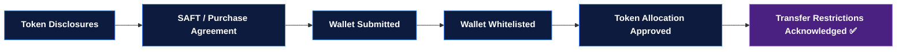

# Investor Onboarding Journey

United Properties TRU™ supports **two distinct offering tracks**. Every investor completes one **shared compliance intake**, and is then routed to the correct track. The token/SAFT process is **not** the default for all investors.

| Track | Instrument | Documents | Status |
|---|---|---|---|
| **A — Limited Partnership Interest Offering** | LP interest in the diversified pool | PPM, Term Sheet, Risk Factors, Accredited Investor Questionnaire, Investor Verification, Subscription Agreement, LP Agreement | **Active path for current investors** |
| **B — Future Security Token / Token Offering** | Security token / SAFT (token warrant) | Token disclosures, SAFT or token purchase agreement | Future / phase-gated |

:::tip[One intake, two tracks]
A Limited Partnership investor follows the PPM → Subscription → LP Agreement path and is **admitted as a limited partner** — not a SAFT/token flow. Both tracks share the same registration, KYC/KYB, AML, accreditation, and verification steps before any offering-specific documents are released.
:::

## Shared Compliance Intake (All Investors)

Every investor completes these steps first, regardless of track:

1. **Registration** — name, email, country of residence, investor type (individual or entity).
2. **KYC / KYB** — identity verification via Sumsub or Persona (individuals) / entity verification with UBO disclosures (entities).
3. **AML screening** — sanctions (OFAC, EU, UN, FATF), PEP, and adverse-media checks.
4. **Accredited Investor Questionnaire** — completed by every investor.
5. **Investor Verification** — document-based verification of accredited status (income / net worth / professional certification).
6. **Admin review & track assignment** — staff confirm intake is complete and assign the investor to **Track A (LP Interest)** or **Track B (Token/SAFT)**.

## Admin Review Gate

:::warning[Gate — before any offering documents]
No investor may access **final offering documents, signing documents, or wire instructions** until an admin has reviewed and approved their completed compliance intake. Track-specific documents are released **only after** this gate is passed.
:::

---

## Track A — Limited Partnership Interest Investor

The LP track is a document-based private-placement flow. The investor reviews the offering, subscribes, and — once the company accepts — is **admitted as a limited partner** in the diversified pool.

### LP Investor Document Checklist

| ✓ | Step |
|---|---|
| ☐ | PPM (Private Placement Memorandum) reviewed |
| ☐ | Term Sheet reviewed |
| ☐ | Risk Factors reviewed |
| ☐ | Accredited Investor Questionnaire completed *(shared intake)* |
| ☐ | Investor Verification completed *(shared intake)* |
| ☐ | Subscription Agreement signed |
| ☐ | LP Agreement signed or acknowledged |
| ☐ | Admin accepted subscription |
| ☐ | Wire instructions released |
| ☐ | Funds received |
| ☐ | Receipt issued |
| ☐ | Investor admitted as Limited Partner |

:::warning[Wire instructions gate]
Wire instructions are **not released** until the investor is **approved, verified, and the company has accepted the subscription.** Funds are only accepted after wire instructions have been formally released.
:::

---

## Track B — Security Token / SAFT Investor

The token track applies to investors participating in the future security-token / SAFT offering. It is **not** the default and is phase-gated to when token instruments are legally available.

### Token / SAFT Investor Document Checklist

| ✓ | Step |
|---|---|
| ☐ | Token disclosures reviewed |
| ☐ | SAFT or token purchase agreement signed *(if applicable)* |
| ☐ | Wallet address submitted *(if applicable)* |
| ☐ | Wallet whitelisted *(if applicable)* |
| ☐ | Token allocation approved *(if legally permitted)* |
| ☐ | Transfer restrictions acknowledged |

SAFT instruments grant pro-rata rights to future $TRU at TGE (see [Tokenomics](./tokenomics.md)). No tokens are issued until they are legally permitted and the applicable phase is reached.

---

## Wire Instructions &amp; Funds — Hard Rules

These rules apply to **both** tracks and are enforced by the admin workflow:

1. **No offering documents, signing documents, or wire instructions** are released before the admin review gate is passed.
2. **Wire instructions** are released only after the investor is **approved, verified, and the company has accepted the subscription** (LP track) or the equivalent approval (token track).
3. **Funds are accepted only after** wire instructions have been formally released.
4. Every release and acceptance is timestamped in the audit trail.

---

## The Seller Journey (Acquisition by Token Exchange)

Property owners are onboarded through a parallel flow designed to convert an illiquid property into a liquid, diversified position — **without giving up future income and appreciation.** Sellers complete the same shared compliance intake.

1. **Inquiry** — owner expresses interest (directly or via an authorized agent).
2. **Property submission** — address, financials, rent roll, condition, and ownership details.
3. **Valuation & due diligence** — the platform underwrites the property and determines its contribution value to the pool.
4. **KYC/KYB + accreditation** — the seller-turned-investor completes the shared compliance intake.
5. **Exchange offer** — the platform presents a token / LP-interest / cash / blended offer, showing the seller's resulting pool position.
6. **Agreement & title transfer** — the property is contributed into a new Series under PropCo Master and added to the pool.
7. **Interest issued** — the seller receives a pool interest (LP interest and/or future tokens) and/or cash, per the agreed mix.
8. **Partner in the pool** — the seller now earns pro-rata income and appreciation across the entire diversified portfolio.

:::tip[Seller takeaways]
Defer a fully-taxable all-cash exit, shed property management and vacancy risk, gain diversification — and keep participating in income and appreciation. Liquidity **without** giving up the upside.
:::

## The Agent / Realtor Channel

United Properties is building an **authorized network of seller agents**. Agents use the exchange structure to win listings they would otherwise lose to cash buyers.

| Step | Agent Action |
|---|---|
| 1 | Join the authorized agent network (application + agreement) |
| 2 | Identify seller clients — especially small landlords nearing retirement |
| 3 | Present the hybrid token/LP-interest exchange offer alongside (or instead of) a cash buyout |
| 4 | Submit the property and shepherd the seller through onboarding |
| 5 | Earn agent compensation on completed acquisitions |

**Why it wins listings:** the agent can offer a seller something no cash buyer can — liquidity, diversification, a deferred taxable exit, and continued income and appreciation.

For acquisitions and agent partnerships: **acquisitions@unitedpropertiestokens.com**

---

## Admin Operations

The admin dashboard supports the shared intake plus both offering tracks:

| Feature | Description |
|---|---|
| Investor list | All investors and sellers, status filter, search, **track label (LP / Token)** |
| Shared intake workflow | Registration → KYC/KYB → AML → Questionnaire → Verification |
| Track assignment | Route each approved investor to LP Interest or Token/SAFT |
| LP document checklist | PPM, Term Sheet, Risk Factors, Subscription, LP Agreement, acceptance, wire, funds, receipt, admission |
| Token document checklist | Disclosures, SAFT/purchase agreement, wallet, whitelist, allocation, transfer restrictions |
| Offering-document release | Locked until admin review gate is passed |
| Wire-instruction release | Locked until approved + verified + subscription accepted |
| Internal notes | Per-investor notes for admin team |
| Audit trail | Timestamped log of every admin action, release, and acceptance |
| AML flags | Escalation queue for any AML screening hits |
| Bulk export | Investor/LP data export for regulatory reporting |
