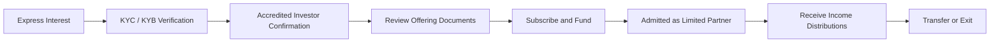

# Investor Participation Model

## Overview

United Properties TRU™ is designed exclusively for verified accredited investors. Investors participate in the platform as **Limited Partners** — owning a fractionalized interest in the platform's entire diversified portfolio of income-producing residential rental properties, not in any single individual property.

This is the fundamental difference from other tokenized real estate platforms that require investors to select and invest in specific properties. United Properties TRU™ investors own a share of the whole portfolio, earning income and appreciation based on the combined performance of all platform properties across multiple locations.

---

## Investor Journey

---

## Step 1 — KYC / KYB Verification

All prospective investors must complete identity and business verification before they are permitted to invest.

**Individual investors (KYC):**
- Government-issued identity document
- Liveness / biometric check
- Sanctions and PEP (Politically Exposed Persons) screening

**Entity investors (KYB):**
- Business registration documentation
- Beneficial ownership verification
- Entity-level AML screening

Third-party verification services (Sumsub and/or Persona) are integrated into the onboarding flow.

---

## Step 2 — Accredited Investor Confirmation

Under Regulation D, Rule 506(c), the platform must take reasonable steps to verify that each investor is an accredited investor. Verification includes review of:

- Income documentation (tax returns, W-2s) for income-based qualification
- Financial statements or advisor confirmation for net-worth-based qualification
- Professional license verification for license-based qualification

Investors who cannot verify accredited investor status will not be permitted to participate.

---

## Step 3 — Review Offering Documents

Once the admin team has accepted the investor through compliance review, the investor receives access to the full offering document package:

- Private Placement Memorandum (PPM)
- Term Sheet
- Risk Factors Disclosure
- Accredited Investor Questionnaire
- Investor Verification Form
- Subscription Agreement
- Limited Partnership Agreement

All documents must be reviewed and acknowledged before subscription proceeds.

---

## Step 4 — Subscribe and Fund

The investor subscribes to participate in the platform's diversified LP portfolio:

1. **Sign Subscription Agreement** — Investor executes the subscription agreement specifying their investment amount
2. **Sign LP Agreement** — Investor acknowledges the Limited Partnership Agreement
3. **Admin acceptance** — The company reviews and formally accepts the subscription
4. **Wire instructions released** — Only after admin acceptance, wire instructions are provided to the investor
5. **Fund** — Investor wires their subscription amount to the Partnership's designated account

:::warning Wire Instructions Gate
Wire instructions are released only after the company has formally accepted the subscription. Investors must not wire funds before receiving confirmed instructions directly from the Partnership.
:::

---

## Step 5 — Admitted as Limited Partner

Upon confirmation of received funds:

- A conditional Receipt of Funds is issued to the investor
- The investor is formally admitted as a Limited Partner
- Partnership records are updated to reflect the investor's LP interest percentage
- The investor receives their LP interest confirmation

LP interests represent a proportional ownership share in the entire Partnership portfolio — not in any individual property.

---

## Step 6 — Income Distributions

Limited Partners receive pro-rata income distributions based on their LP interest percentage.

- **Source** — Rental income collected across all platform properties, net of operating expenses and platform fees
- **Calculation** — Each LP's distribution equals their ownership percentage × net distributable income for the period
- **Frequency** — Monthly or quarterly as specified in the LP Agreement
- **Method** — Wire transfer or USDC as agreed with the investor

Because investors own a share of the entire portfolio, their income is not dependent on any single property's performance. Vacancy or underperformance in one property is offset by income from the rest of the portfolio.

---

## Step 7 — Secondary Transfers and Exit

**Secondary transfers** — LP interests may be transferred to other verified investors subject to the restrictions in the LP Agreement and applicable securities law.

**Exit** — Investors may exit by transferring their LP interest to another verified buyer. At platform wind-down, proceeds are distributed to Limited Partners pro-rata.

**Future token liquidity (Phase 4)** — A compliant secondary market is planned for Phase 4, providing additional liquidity without requiring investors to fully exit their income-producing position.

---

## What LP Investors Own

| Feature | LP Interest |
|---|---|
| Ownership | Proportional share of the entire portfolio |
| Income | Pro-rata share of all rental income across all properties |
| Appreciation | Pro-rata share of appreciation across the full portfolio |
| Risk exposure | Diversified across multiple properties and locations |
| Property protection | Each property held in isolation — problems in one do not affect others |

This is materially different from platforms where investors pick individual properties and accept concentration risk in a single asset.
