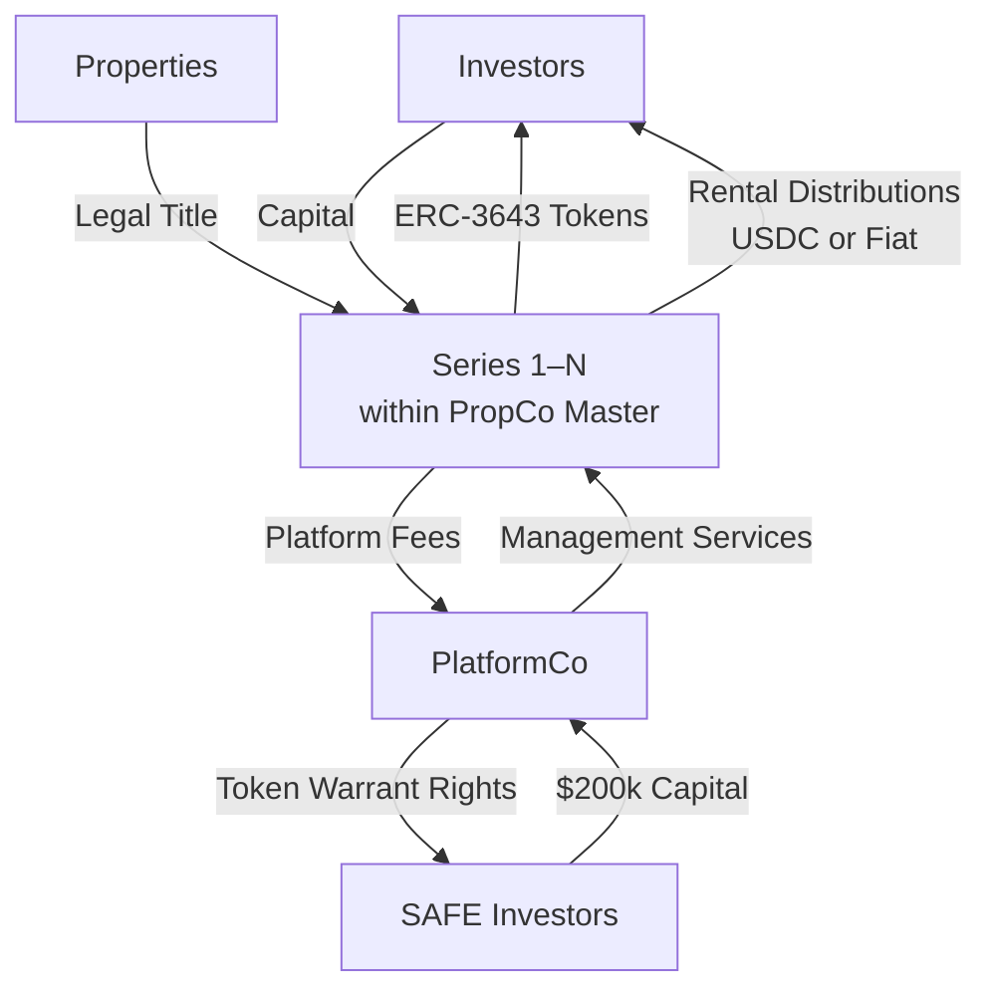

# Platform Ecosystem

## Overview

The United Properties TRU™ platform ecosystem consists of four principal actors, each operating within a defined legal and commercial structure. Understanding how these actors relate to each other — and how value, fees, and risk flow between them — is central to understanding the platform's design.

---

## The Four Principal Actors

| Actor | Description |
|---|---|
| **Investors** | Verified accredited investors who purchase ERC-3643 property tokens in individual series offerings |
| **Properties** | Income-producing real estate assets, each held within a dedicated, bankruptcy-remote series |
| **Series Entities** | Individual compartments within PropCo Master (Delaware Series LLC), each holding one property and issuing one set of tokens |
| **PlatformCo** | The Delaware C-Corp that manages all series, earns platform fees, holds the technology and IP, and is the entity into which early investors participate |

---

## How the Actors Interact

---

## Value and Cash Flow

### Capital Flows

1. Early-stage investors provide **$200,000 capital** to PlatformCo via SAFE agreements. This capital funds legal formation, platform development, and Phase 1 infrastructure.

2. Property investors provide **investment capital** directly to individual series in exchange for ERC-3643 property tokens. This capital is used to acquire the underlying property.

### Revenue Flows

3. Each property series pays **platform fees** to PlatformCo at origination, tokenization, disposition, and on an ongoing basis for asset management. Secondary transfer fees are also paid to PlatformCo.

4. Net rental income (after platform fees and expenses) is distributed by each series to its **token holders** pro-rata, in USDC or fiat, on a monthly or quarterly basis.

---

## Risk Isolation

A central design principle of the ecosystem is the isolation of risk between entities:

**Property risk is contained within each series.** If a property experiences a significant financial event (vacancy, structural damage, default on any property-level obligation), the financial impact is limited to the relevant series and its token holders. PlatformCo and all other series are unaffected.

**Platform risk is contained within PlatformCo.** If PlatformCo encounters financial difficulty — for example, a revenue shortfall during the early phases of the platform — the assets held within individual property series are not at risk. Series assets are held separately under Delaware Series LLC law and are not available to PlatformCo's creditors.

This bidirectional isolation is expressed in the memo as: *"Property risk stays inside each series; platform risk stays inside PlatformCo. If either fails, the other survives."*

---

## Ecosystem Summary

| Flow | From | To | Mechanism |
|---|---|---|---|
| Early capital | SAFE investors | PlatformCo | Post-money SAFE |
| Property capital | Property investors | Series 1–N | Subscription / token purchase |
| Platform fees | Series 1–N | PlatformCo | Fee contracts |
| Rental distributions | Series 1–N | Property token holders | On-chain snapshot, USDC/fiat |
| Management services | PlatformCo | Series 1–N | Manager role under Series LLC |
| Token rights (future) | PlatformCo | SAFE investors | Token warrant side letter |

---

## Ecosystem Growth Mechanics

The ecosystem is designed to grow with each additional property onboarded. Each new series:

- Adds a new stream of origination, tokenization, and asset management fee revenue to PlatformCo
- Adds a new pool of property token holders to the investor community
- Increases total platform AUM, which in turn drives secondary transfer revenue and eventual disposition fee revenue

Because each new series is created within the existing PropCo Master structure at near-zero marginal legal cost, the incremental cost of onboarding each additional property is low relative to the incremental fee revenue it generates.
