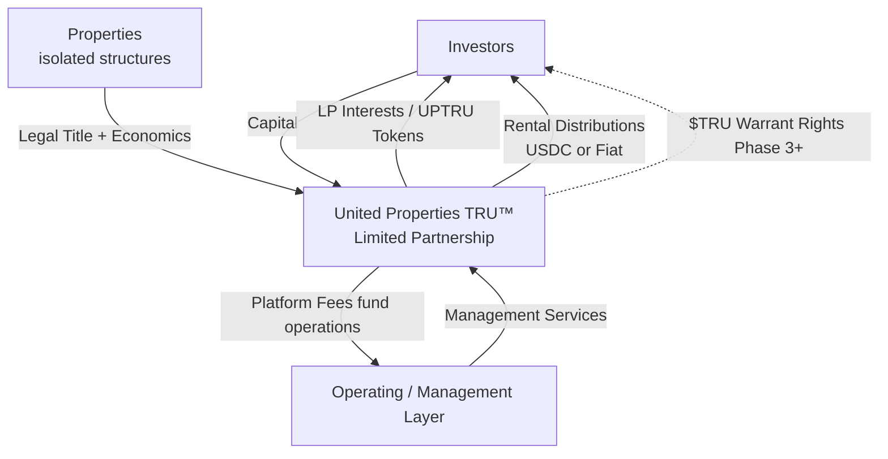

# Platform Ecosystem

## Overview

The United Properties TRU™ platform ecosystem consists of four principal actors, each operating within a defined legal and commercial structure. Understanding how these actors relate to each other — and how value, fees, and risk flow between them — is central to understanding the platform's design.

---

## The Four Principal Actors

| Actor | Description |
|---|---|
| **Investors** | Verified accredited investors who acquire a diversified interest in the whole portfolio (LP interests / UPTRU property tokens) in the Partnership's Reg D 506(c) offering |
| **Properties** | Income-producing real estate assets, each held within a dedicated, bankruptcy-remote legal structure |
| **The Partnership** | United Properties TRU™ Limited Partnership (Missouri LP) — the entity investors buy into; owns the business model/IP, earns platform fees, and holds UPTRU tokens (received as payment for its IP) that earn from the diversified property pool; distributes income to LPs |
| **Operating / Management Layer** | Provides day-to-day technology and management services to the Partnership (the Partnership owns the IP); not the entity investors buy into |

---

## How the Actors Interact

---

## Value and Cash Flow

### Capital Flows

1. Early-stage investors provide the initial **$200,000 development capital**. This capital funds legal formation, platform development, and Phase 1 infrastructure.

2. Property investors provide **investment capital** to the Partnership in exchange for a diversified interest in the whole portfolio (LP interests / UPTRU property tokens). This capital is used to acquire properties into the portfolio.

### Revenue Flows

3. The portfolio generates **platform fees** to the Partnership at origination, tokenization, disposition, and on an ongoing basis for asset management. Secondary transfer fees also accrue to the Partnership. These fees fund the operating/management layer's services.

4. Net rental income (after platform fees and expenses) is distributed by the Partnership to its **token / LP holders** pro-rata, in USDC or fiat, on a monthly or quarterly basis.

---

## Risk Isolation

A central design principle of the ecosystem is the isolation of risk between entities:

**Property risk is contained within each property structure.** If a property experiences a significant financial event (vacancy, structural damage, default on any property-level obligation), the impact is limited to that property; the rest of the portfolio and its diversified investors are cushioned. Because investors own a diversified interest across the whole portfolio, a single property's problem does not fall on any one investor.

**Operating risk is contained within the operating/management layer.** If the operating layer encounters financial difficulty — for example, a revenue shortfall during the early phases — the properties held for the Partnership are not at risk, as they sit in separate bankruptcy-remote structures and are not available to the operating layer's creditors.

This bidirectional isolation is expressed in the memo as: *"Property risk stays inside each isolated property structure; operating risk stays inside the operating layer. If either fails, the portfolio held for investors survives."*

---

## Ecosystem Summary

| Flow | From | To | Mechanism |
|---|---|---|---|
| Early capital | Early investors | The Partnership | Subscription (development raise) |
| Property capital | Property investors | The Partnership | Subscription / token purchase |
| Platform fees | The portfolio | The Partnership | Fee arrangements |
| Rental distributions | The Partnership | Token / LP holders | On-chain snapshot, USDC/fiat |
| Management services | Operating / management layer | The Partnership | Management arrangement |
| $TRU rights (future) | Platform | SAFT holders | Token warrant side letter |

---

## Ecosystem Growth Mechanics

The ecosystem is designed to grow with each additional property onboarded. Each new property added to the portfolio:

- Adds a new stream of origination, tokenization, and asset management fee revenue to the Partnership
- Deepens the diversified portfolio that all token / LP holders own a share of
- Increases total platform AUM, which in turn drives secondary transfer revenue and eventual disposition fee revenue

Because each new property is placed in an isolated structure feeding the existing portfolio at near-zero marginal legal cost, the incremental cost of onboarding each additional property is low relative to the incremental fee revenue it generates.
