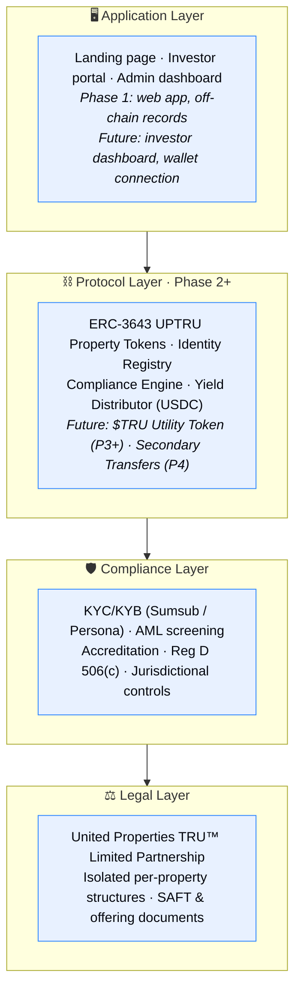

# Platform Architecture

The United Properties TRU™ platform is built in two distinct stages: an **off-chain Phase 1** that handles investor compliance and SAFT onboarding, and a **future on-chain layer** that handles token issuance, distributions, and secondary transfers.

## Four-Layer Model

## Phase 1 Product Architecture (Off-Chain)

Phase 1 is a web application with no blockchain interaction. It delivers:

| Component | Description |
|---|---|
| **Landing page** | Platform overview, investor education, registration CTA |
| **Investor portal** | Registration, document upload, status tracking |
| **KYC/KYB integration** | Third-party provider (Sumsub or Persona) |
| **Accreditation workflow** | Income/net-worth verification, supporting document review |
| **SAFT flow** | E-signature, agreement delivery, investor record creation |
| **Admin dashboard** | Investor management, status workflows, notes, audit trail |
| **Document storage** | Encrypted, compliant storage for all investor documents |
| **Notifications** | Email alerts for status changes and action items |
| **Audit trail** | Immutable logs of all admin actions and investor events |

## Future On-Chain Architecture (Phase 2+)

When the first property is tokenized, the following blockchain components are deployed:

| Component | Description |
|---|---|
| **ERC-3643 UPTRU Property Tokens** | Permissioned tokens representing a diversified interest in the whole portfolio |
| **Identity Registry** | Maps verified wallet addresses to investor identities |
| **Compliance Engine** | Enforces transfer rules on-chain (whitelisted wallets only) |
| **Yield Distributor** | Snapshot-based USDC distributions to token holders |
| **Investor Dashboard** | Portfolio view, distribution history, property details |
| **Wallet connection** | WalletConnect / MetaMask integration |
| **Custody integration** | Institutional custody option for large holders |

## Blockchain & Infrastructure

The target network is an Ethereum-compatible L2 for lower gas costs and faster finality. The ERC-3643 standard (T-REX protocol) enforces permissioned transfers at the token contract level — every transfer is verified against the on-chain identity registry before it executes.
