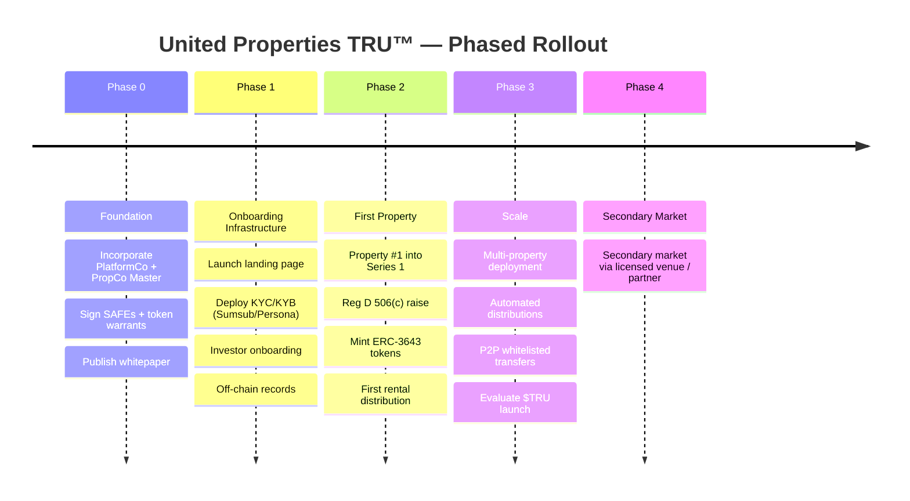

# Roadmap

## Phased Rollout

United Properties TRU™ follows a deliberate, phased rollout strategy designed to establish legal infrastructure and compliance capabilities before any blockchain activity occurs. This approach de-risks the platform by ensuring that the regulatory and operational foundations are solid before tokens are minted or distributed.

---

## Phase 0 — Foundation

**On-chain activity:** None

This phase establishes the legal and financial foundation of the platform before any product development or investor onboarding begins.

**Scope:**
- Incorporate PlatformCo (Delaware C-Corporation)
- Form PropCo Master (Delaware Series LLC), with PlatformCo named as manager in the master operating agreement
- Execute SAFE agreements with committed early investors into PlatformCo
- Execute token warrant side letters with those same investors
- Publish the platform whitepaper

**Key actions (Next Steps):**
1. Confirm SAFE valuation cap and target close date for the $200k raise
2. Engage Delaware counsel for C-Corp and Series LLC formation, and to draft the master operating agreement naming PlatformCo as manager (estimated legal cost: $8–15k)
3. Execute SAFEs + token warrant side letters with committed investors
4. Draft public whitepaper and Phase 1 product requirements document in parallel
5. Identify Property #1 and target market for the Series 1 Reg D raise

---

## Phase 1 — Onboarding Infrastructure

**On-chain activity:** None

This phase builds the investor-facing infrastructure needed to onboard verified investors. No property has been tokenised yet; all records are maintained off-chain.

**Scope:**
- Launch the investor-facing landing page
- Deploy KYC/KYB verification workflow using Sumsub and/or Persona
- Build and test investor onboarding flow (identity verification, accredited investor confirmation, wallet registration)
- Establish off-chain records system for investor data and investment records

---

## Phase 2 — First Property

**On-chain activity:** Single asset

This phase marks the first live deployment of the full tokenisation stack. A single property is placed into Series 1, a Reg D offering is conducted, ERC-3643 tokens are minted and distributed, and the first rental income distribution is made to token holders.

**Scope:**
- Onboard the first property into Series 1 of PropCo Master
- Conduct the Series 1 Reg D 506(c) offering
- Mint ERC-3643 property tokens and distribute to verified investors
- Collect first rental income and make the first on-chain distribution to token holders in USDC or fiat

---

## Phase 3 — Scale and Multi-Property

**On-chain activity:** Yes — full platform

This phase scales the platform to multiple properties and introduces automated on-chain distribution infrastructure. The decision on whether to proceed with the platform utility token ($TRU) launch is evaluated at this stage.

**Scope:**
- Onboard multiple properties into separate series within PropCo Master
- Deploy automated distribution infrastructure for pro-rata rental income payments
- Enable peer-to-peer (P2P) whitelisted secondary transfers between verified investors
- Evaluate the readiness and regulatory landscape for a $TRU platform utility token launch

---

## Phase 4 — Secondary Market

**On-chain activity:** Conditional

This phase introduces a formal secondary market for property token trading through a licensed venue or regulated partner. Secondary market availability is conditional on regulatory approvals and the identification of a suitable licensed venue.

**Scope:**
- Establish secondary market access via a licensed trading venue or regulated partner
- Enable structured token liquidity for existing property token holders within the compliant transfer framework

---

## Phase Summary

| Phase | Scope | On-Chain |
|---|---|---|
| 0 | Incorporate PlatformCo + PropCo Master; sign SAFEs + warrants; whitepaper | No |
| 1 | Landing page, KYC/KYB (Sumsub/Persona), investor onboarding, off-chain records | No |
| 2 | First property into Series 1; Reg D raise; mint tokens; first rental distribution | Single asset |
| 3 | Multi-property, automated distributions, P2P whitelisted transfers; evaluate $TRU | Yes |
| 4 | Secondary market via licensed venue / partner | Conditional |
