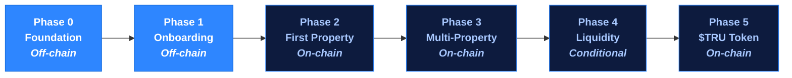

# Roadmap

United Properties TRU™ follows a six-phase roadmap designed to de-risk execution: compliance and legal infrastructure first, then on-chain components only once the foundation is proven.

| Phase | Name | On-Chain? | Status |
|---|---|---|---|
| 0 | Foundation | No | In progress |
| 1 | Landing & Onboarding | No | In development |
| 2 | First Property | Single asset | Planned |
| 3 | Multi-Property | Yes | Planned |
| 4 | Secondary Liquidity | Conditional | Planned |
| 5 | Utility Token ($TRU) | Yes | Planned |

---

## Phase 0 — Foundation

**Goal:** Establish the corporate, legal, and financing foundation.

- Delaware C-Corp (PlatformCo) incorporated
- Delaware Series LLC (PropCo Master) incorporated
- Master operating agreement drafted
- SAFE agreements executed with committed investors ($200k target)
- Token warrant side letters signed
- Whitepaper drafted and reviewed by legal counsel
- Property #1 identified and pipeline started

---

## Phase 1 — Landing & Onboarding

**Goal:** Build the investor-facing portal and compliance infrastructure. No blockchain.

- Public landing page and investor education content live
- Investor registration and portal launched
- KYC/KYB integration (Sumsub or Persona)
- AML screening live
- Accredited investor verification workflow
- Risk disclosure and acknowledgment flow
- SAFT agreement and e-signature flow
- Seller acquisition workflow (property submission, valuation, token/cash exchange offer)
- Authorized agent / Realtor network onboarding
- Admin dashboard: investor and seller management, status workflows, notes
- Off-chain investor and seller records and audit trail
- Notification system (email alerts)

---

## Phase 2 — First Property &amp; Pool

**Goal:** Acquire the first property into the diversified pool and complete the first tokenized raise end-to-end.

- First property acquired (token exchange and/or cash) and placed in Series 1 under PropCo Master
- Diversified pool established to hold the Series and issue pool tokens
- Reg D 506(c) offering documents prepared with counsel
- ERC-3643 smart contracts deployed and audited
- First pool tokens minted
- Investor and seller wallets verified and whitelisted
- Reg D raise completed with verified accredited investors
- First rental income distributed in USDC to token holders
- Investor dashboard launched (pool view, distribution history)

---

## Phase 3 — Multi-Property

**Goal:** Scale to multiple properties with automated operations.

- Multiple property series live simultaneously
- Automated USDC distribution engine
- P2P whitelisted token transfers between verified investors
- Enhanced investor dashboard (multi-property portfolio view)
- Third-party property originator onboarding (Phase 3+)
- $TRU utility token economics evaluated and finalized
- Begin SAFT conversion planning

---

## Phase 4 — Secondary Liquidity

**Goal:** Enable a compliant secondary market for property tokens.

- Whitelisted transfer marketplace (internal or partner venue)
- Licensed secondary trading partner integration (if required by regulation)
- Transfer compliance engine hardened
- Fee structure for secondary transfers active
- Liquidity provider / market-making arrangements established

---

## Phase 5 — Utility Token ($TRU)

**Goal:** Launch the $TRU utility token and transition to community governance.

- $TRU token economics finalized and published
- SAFT agreements processed — token warrants converted to $TRU at TGE
- Token Generation Event (TGE) executed
- Platform access tiers and fee discounts activated
- Loyalty and rewards programs launched
- DAO governance module deployed
- Treasury transferred to community governance
- $TRU listed on secondary venues
