# The Solution

United Properties TRU™ resolves the seller's dilemma directly: it lets an owner **convert an illiquid single property into a liquid, diversified, income-producing token position** — keeping their participation in future income and appreciation instead of giving it up for cash.

We do this by running a **tokenized real estate rollup**: acquiring residential rentals (with tokens and/or cash), aggregating them into a diversified pool, and issuing tokens that represent a fractional interest in the **whole portfolio**.

:::tip[The one-sentence pitch]
**Sell your property without selling your future** — exchange it for tokens and keep earning income and appreciation across a diversified national portfolio.
:::

## How It Works

```mermaid
flowchart LR
    S["🏠 Owner's property<br/>(1 of ~50M rentals)"] --> X["🤝 Token exchange<br/>tokens and/or cash"]
    X --> B["⚖️ Series LLC<br/>added to the pool"]
    B --> P["🏦 Diversified Pool<br/>many properties, many markets"]
    P --> C["🪙 ERC-3643 tokens<br/>fractional pool interest"]
    C --> D["✅ Reg D 506(c)<br/>verified investors"]
    D --> E["💵 USDC / fiat yield<br/>pro-rata to holders"]
    E --> F["🔄 Secondary transfers<br/><i>liquidity, future phases</i>"]

    classDef step fill:#0d1b3e,stroke:#2E86FF,color:#ffffff,font-weight:600;
    class S,X,B,P,C,D,E,F step;
```

### Step-by-Step

1. **Acquisition by token exchange.** An owner contributes their property to the platform in return for tokens (and/or cash, if they prefer). The seller moves from active landlord to **passive partner** — and, critically, keeps participating in income and appreciation.
2. **Legal structuring.** Each acquired property is placed into its own dedicated **Series under PropCo Master** (Delaware Series LLC), which is bankruptcy-remote: one property's risk cannot contaminate the others or PlatformCo.
3. **Aggregation into a diversified pool.** The Series are held within a **master pool**. Token holders own an interest in the pool — not a single Series — so exposure spans many property types and locations.
4. **Tokenization.** The pool is represented as ERC-3643 permissioned tokens. Tokens are denominated for low minimums (e.g., $100), making the diversified portfolio accessible at any ticket size.
5. **Regulated capital raise.** Tokens are offered to verified accredited investors under Reg D 506(c). KYC/KYB and accreditation are required before anyone can participate.
6. **Yield distribution.** Net rental income from across the pool is distributed pro-rata to token holders in USDC or fiat, monthly or quarterly, via a snapshot mechanism.
7. **Managed secondary transfers.** In later phases, holders can transfer positions to other verified wallets, with compliance enforced on-chain by ERC-3643 — turning a once-illiquid asset into a liquid one.

## Why a Diversified Pool — Not One Property

A token in United Properties is **a fractionalized interest in a diversified pool of income-producing and appreciating residential rental properties**, across types and locations. This is a deliberate design choice:

- **Returns are diversified by default** — income and appreciation come from many properties in many markets, not a single building's fortunes.
- **Single-property risk is diversified away** — one vacancy, one bad market, or one problem tenant doesn't sink the position.
- **No property-picking required** — investors don't have to select and underwrite an individual asset to participate; sellers don't end up over-concentrated in the one property they just sold.

## What No One Else Is Doing

The market is full of platforms that tokenize real estate. The decisive difference:

| | Typical RE tokenization / institutional buyers | United Properties TRU™ |
|---|---|---|
| Seller's future income & appreciation | Forfeited at sale | **Retained** via tokens |
| What the holder owns | One specific property | A **diversified pool** |
| Seller outcome | Cash, then out | Liquid **and** still participating |
| Diversification | Investor must assemble it | **Built in** |

:::warning[The moat]
Everyone else buys the property and keeps all future income and appreciation. We let the seller keep it — delivering **liquidity without giving up the upside.** That combination is what makes a seller hard-pressed to choose anyone else.
:::

## The Agent / Realtor Channel

United Properties is building an **authorized network of seller agents**. Real estate agents can offer the token-exchange structure as an alternative to a traditional cash buyout — helping them **win listings** they would otherwise lose, while giving their seller clients a better outcome (liquidity, diversification, deferred all-cash taxable exit, and continued upside). See [Investor Onboarding](./investor-onboarding.md) for the seller and agent journeys.

## The Token Model

Property (Asset) Token — ERC-3643

✦ Fractional interest in the diversified pool

✦ USDC / fiat rental yield, pro-rata

✦ Exposure to portfolio-wide appreciation

✦ Permissioned · Reg D 506(c) compliant

$TRU Token (ERC-20)

✦ Platform utility — fee discounts, tiers

✦ DAO governance rights (Phase 5+)

✦ 1B fixed supply · No rental rights

✦ Issued at TGE via SAFT warrants

United Properties TRU™ operates two token types (plus pre-launch GP interests — see [Tokenomics](./tokenomics.md)):

| | Property (Asset) Token | Utility Token ($TRU) |
|---|---|---|
| **What it is** | Fractional interest in the diversified property pool | Platform-level access, benefits, governance |
| **Scope** | The whole portfolio (not one building) | Platform-wide |
| **Yield** | Pro-rata rental income + appreciation | No rental or profit share |
| **Standard** | ERC-3643 (permissioned) | ERC-20 |
| **Launch** | Phase 2 (first pool) | Phase 5 |
| **Transferability** | Whitelisted wallets only | Standard (post-launch) |

:::warning[Important distinction]
Property tokens represent a fractional interest in the **diversified pool of properties** — they are **not** equity in PlatformCo and **not** the $TRU utility token.
:::

## Phase 1: Off-Chain First

The platform deliberately starts without any blockchain components. Phase 1 delivers:

- Public landing page plus seller and investor education
- Investor and seller registration with full KYC/KYB, AML, and accreditation verification
- SAFT agreement flow (token warrant rights for early investors)
- The seller acquisition workflow and authorized agent network
- Admin dashboard and off-chain record management

This validates compliance infrastructure, builds the investor and seller pipelines, and assembles the first pool — before incurring the cost and complexity of on-chain deployment.

See the [roadmap](./roadmap.md) for the full phase-by-phase breakdown.
