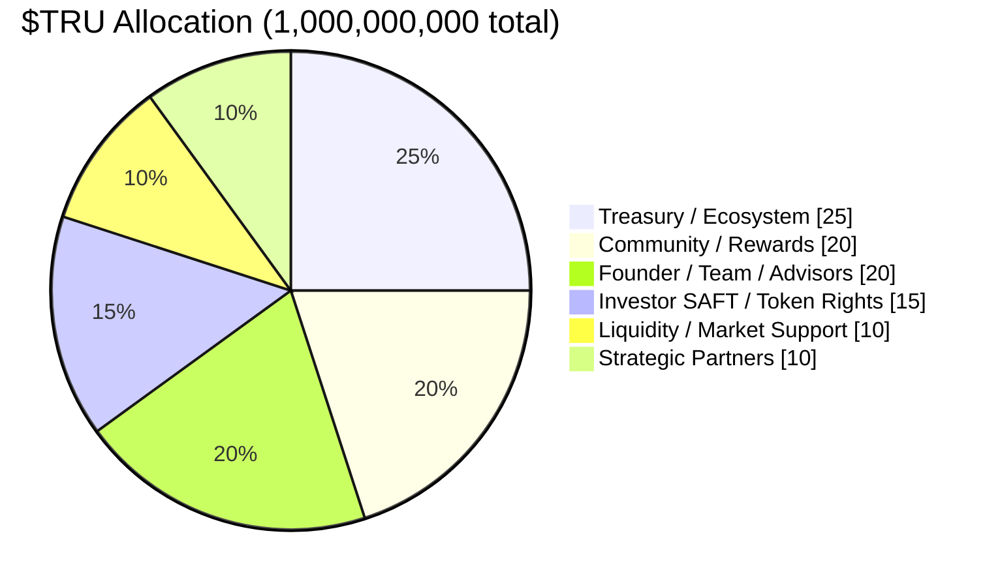

# Tokenomics

:::note Phase 5
The $TRU utility token is planned for **Phase 5** of the roadmap. Token economics described here are subject to finalization. No utility tokens are issued in Phases 0–4.
:::

## The $TRU Token

**$TRU** is the native utility token of the United Properties TRU™ platform. It is entirely distinct from property tokens — $TRU operates at the platform level and does not represent ownership in any specific property.

| Parameter | Value |
|---|---|
| Token name | United Properties Token |
| Symbol | TRU |
| Total supply | 1,000,000,000 TRU (fixed, no inflation) |
| Standard | ERC-20 |
| Issuance | Phase 5 (Utility Token launch) |
| Early rights | SAFT token warrants (Phase 1 investors) |

## Token Allocation

| Allocation | % | Tokens |
|---|---|---|
| Treasury / Ecosystem Growth | 25% | 250,000,000 |
| Community / Rewards / Platform Usage | 20% | 200,000,000 |
| Founder / Team / Advisors | 20% | 200,000,000 |
| Investor SAFT / Token Rights | 15% | 150,000,000 |
| Liquidity / Market Support | 10% | 100,000,000 |
| Strategic Partners | 10% | 100,000,000 |

## Vesting Schedule

| Allocation | Cliff | Vesting |
|---|---|---|
| Founder / Team / Advisors | 12 months | 36 months linear |
| Investor SAFT / Token Rights | At TGE (per SAFT terms) | Pro-rata by SAFT |
| Treasury / Ecosystem | None | Governance-controlled release |
| Community / Rewards | None | Earned via platform activity |
| Liquidity / Market Support | None | Deployed at TGE |
| Strategic Partners | 6 months | 24 months linear |

## SAFT Token Rights (Phase 1)

Phase 1 investors receive a **SAFT (Simple Agreement for Future Tokens)** instrument via a token warrant side letter alongside their SAFE investment in PlatformCo. Key terms:

- Each SAFT investor receives pro-rata rights to the **Investor SAFT / Token Rights** allocation (15% of supply)
- Rights convert to $TRU at the Token Generation Event (TGE) in Phase 5
- No tokens are issued or transferred until TGE
- Terms are identical for all Phase 1 investors — no per-investor negotiation

## Emissions & Value Accrual

- **Emissions:** Community/Rewards tokens are earned by platform participants through usage milestones, staking, and referral programs.
- **Fee sinks:** A portion of platform fees (origination, tokenization, secondary transfer) flows into the Treasury. A share is used for $TRU buybacks at governance discretion.
- **No rental yield:** $TRU does NOT entitle holders to rental income. That right belongs exclusively to Property Token holders.
