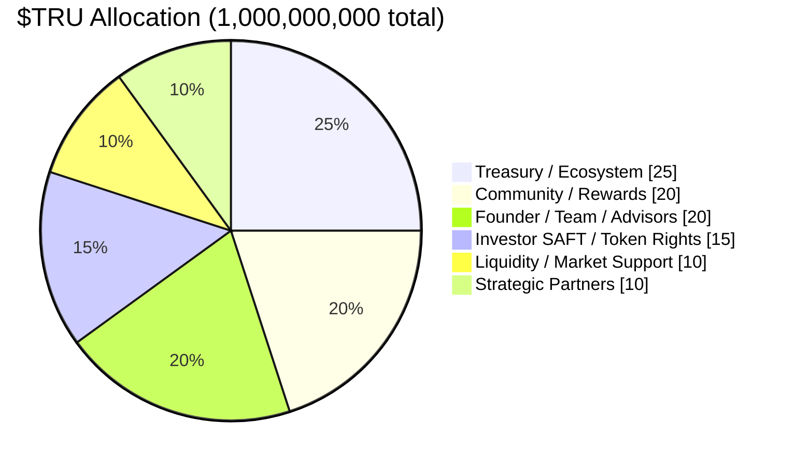

# Tokenomics

:::note Phase 3+
The $TRU utility token is **evaluated at Phase 3** and, if approved, launched at a later **Token Generation Event (TGE)** — Phase 3+ on the roadmap. Token economics described here are subject to finalization. No utility tokens exist or are issued before that TGE; Phase 1 investors hold only contingent SAFT token-warrant rights.
:::

## The $TRU Token

**$TRU** is the native utility token of the United Properties TRU™ platform. It is entirely distinct from property tokens — $TRU operates at the platform level and does not represent ownership in any specific property.

| Parameter | Value |
|---|---|
| Token name | United Properties Token |
| Symbol | TRU |
| Total supply | 1,000,000,000 TRU (fixed, no inflation) |
| Standard | ERC-20 |
| Issuance | Phase 3+ (Utility Token launch) |
| Early rights | SAFT token warrants (Phase 1 investors) |

## Token Allocation

| Allocation | % | Tokens |
|---|---|---|
| Treasury / Ecosystem Growth | 25% | 250,000,000 |
| Community / Rewards / Platform Usage | 20% | 200,000,000 |
| Founder / Team / Advisors | 20% | 200,000,000 |
| Investor SAFT / Token Rights | 15% | 150,000,000 |
| Liquidity / Market Support | 10% | 100,000,000 |
| Strategic Partners | 10% | 100,000,000 |

## Vesting Schedule

| Allocation | Cliff | Vesting |
|---|---|---|
| Founder / Team / Advisors | 12 months | 36 months linear |
| Investor SAFT / Token Rights | At TGE (per SAFT terms) | Pro-rata by SAFT |
| Treasury / Ecosystem | None | Governance-controlled release |
| Community / Rewards | None | Earned via platform activity |
| Liquidity / Market Support | None | Deployed at TGE |
| Strategic Partners | 6 months | 24 months linear |
| **Partners, Vendors & Community Grants** | **None** | **None — immediate vesting** |

### No-Vesting Allocation (Partners, Vendors & Community Grants)

A designated portion of the total token supply is reserved for issuance **without a vesting schedule**. This allocation is designed to facilitate:

- **Vendor and contractor payments** — Service providers, contractors, and merchants who accept $TRU in lieu of cash receive immediately-vested tokens, enabling real-world token utility without the burden of a 4-year vesting clock
- **Family and friends** — Early supporters and community members who receive tokens as relationship grants (not investment instruments) receive immediately-vested tokens
- **Community and referral grants** — Token grants made to individuals for non-investment purposes (referrals, community building, advisory) may be issued without vesting where appropriate
- **Seller token exchanges** — Property sellers who exchange their property for tokens may receive immediately-vested tokens depending on deal structure

:::note Disclosure
The existence of a no-vesting allocation will be fully disclosed in all offering materials. Immediate-vesting recipients should be aware that their tokens are subject to applicable securities and tax regulations. This allocation does not dilute the vesting rights of Founder/Team, SAFT investors, or Strategic Partner allocations, which retain their full vesting schedules as described above.
:::

## Presale — Crypto Crossover Opportunity

Prior to the public Token Generation Event (TGE), United Properties TRU™ will offer a **presale round with a token bonus** targeted in part at holders of Bitcoin, Tether (USDT), and other speculative cryptocurrencies who want to exchange their holdings for a productive, asset-backed digital token.

### The Case Against Bitcoin as a Long-Term Store of Value

Bitcoin has a hardcoded maximum supply of 21 million coins. Despite its scarcity:

- Bitcoin is **not backed by any physical or hard asset** — no property, no gold, no government guarantee
- Bitcoin **produces zero income** for holders — no rental yield, no dividends, no coupon payments
- Its valuation rests entirely on **speculation, network effects, and scarcity** — not on fundamental cash flows that can be analyzed or modeled
- A portion of all Bitcoin ever minted is estimated to be permanently lost to forgotten passwords and discarded hardware — yet remaining holders still earn nothing

A Bitcoin holder owns a finite digital asset that produces no income and is backed by nothing except the next buyer's willingness to pay more.

### The Case Against Tether as an Income Vehicle

Tether USDT is the world's most widely held stablecoin. Its reserves are primarily held in US Treasury Bills — meaning Tether earns significant yield from those holdings. However:

- **Every dollar of that yield goes to Tether's corporate balance sheet** — not to USDT holders
- USDT holders earn **zero income** on their holdings while Tether profits from their deposits
- Tether can **freeze any wallet** at law enforcement request
- Tether has never completed a full independent audit — only point-in-time "attestations"

A Tether holder is effectively lending their capital to Tether so Tether can earn interest income on it — and receiving nothing in return except a dollar peg.

### Why $TRU Is Structurally Superior

| | Bitcoin (BTC) | Tether (USDT) | **$TRU (United Properties)** |
|---|---|---|---|
| Backed by hard asset | ❌ None | Partial (mostly T-bills) | ✅ Real residential property |
| Income paid to holders | ❌ Zero | ❌ Zero (Tether keeps it) | ✅ Rental distributions |
| Appreciation for holders | Speculative only | ❌ Pegged to USD | ✅ Property portfolio appreciation |
| Supply | 95.4% already minted | Unlimited (centralized issuance) | ✅ Fixed 1B — no inflation |
| Regulatory path | Uncertain | High freeze + shutdown risk | ✅ Reg D, fully compliant |
| Transparency | Full on-chain ledger | Attestation only, no full audit | ✅ Platform records + on-chain |
| Counterparty risk | Zero (decentralized) | High (Tether can freeze/fail) | Managed (Reg D structure) |

$TRU is anchored to a growing portfolio of real income-producing residential real estate. For BTC or Tether holders who want to move from speculative or non-yielding assets to a productive, asset-backed token — with rental income distributions, real property appreciation, and a clear regulatory structure — the United Properties TRU™ presale provides the exchange pathway with a **bonus allocation available only prior to public launch**.

:::note Presale Terms
Presale terms, exchange ratios, and bonus structures are subject to finalization by the Managing General Partner and qualified U.S. securities counsel. Participation is limited to verified accredited investors. See the current offering documents for final terms.
:::

---

## SAFT Token Rights (Phase 1)

Phase 1 investors receive a **SAFT (Simple Agreement for Future Tokens)** instrument via a token warrant side letter alongside their SAFE investment in PlatformCo. Key terms:

- Each SAFT investor receives pro-rata rights to the **Investor SAFT / Token Rights** allocation (15% of supply)
- Rights convert to $TRU at the Token Generation Event (TGE) in Phase 3+
- No tokens are issued or transferred until TGE
- Terms are identical for all Phase 1 investors — no per-investor negotiation

## Emissions & Value Accrual

- **Emissions:** Community/Rewards tokens are earned by platform participants through usage milestones, staking, and referral programs.
- **Fee sinks:** A portion of platform fees (origination, tokenization, secondary transfer) flows into the Treasury. A share is used for $TRU buybacks at governance discretion.
- **No rental yield:** $TRU does NOT entitle holders to rental income. That right belongs exclusively to Property Token holders.
