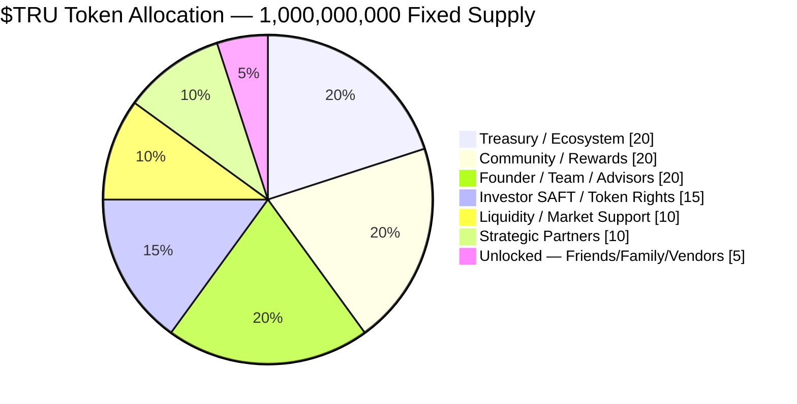

# Tokenomics

:::note[Phase 5]
The $TRU utility token is planned for **Phase 5** of the roadmap. Token economics described here are subject to finalization. No utility tokens are issued in Phases 0–4.
:::

## The Platform's Three Instruments

$TRU is one of three distinct instruments. It's important not to confuse them:

| Instrument | Standard | Represents | Income |
|---|---|---|---|
| **Asset (Property) Tokens** | ERC-3643 | Fractional interest in the **diversified property pool** | Rental income + appreciation |
| **Utility Token ($TRU)** | ERC-20 | Platform access, discounts, priority, governance | None (no rental/profit share) |
| **LP Interests** | SAFE / equity | Ownership of PlatformCo — business model, IP, trade secrets, fee revenue | Platform fees |

This page covers **$TRU**. For asset tokens see [Property Tokens](./property-tokens.md); for LP interests and projections see [Business Valuation](./business-valuation.md).

## The $TRU Token

**$TRU** is the native utility token of the United Properties TRU™ platform. It is entirely distinct from property/asset tokens — $TRU operates at the platform level and does not represent ownership in any specific property or in the pool.

| Parameter | Value |
|---|---|
| Token name | United Properties Token |
| Symbol | TRU |
| Total supply | 1,000,000,000 TRU (fixed, no inflation) |
| Standard | ERC-20 |
| Issuance | Phase 5 (Utility Token launch) |
| Early rights | SAFT token warrants (Phase 1 investors) |

## Token Allocation

| Allocation | % | Tokens |
|---|---|---|
| Treasury / Ecosystem Growth | 20% | 200,000,000 |
| Community / Rewards / Platform Usage | 20% | 200,000,000 |
| Founder / Team / Advisors | 20% | 200,000,000 |
| Investor SAFT / Token Rights | 15% | 150,000,000 |
| Liquidity / Market Support | 10% | 100,000,000 |
| Strategic Partners | 10% | 100,000,000 |
| **Friends, Family, Vendors & Contractors (Unlocked)** | **5%** | **50,000,000** |
| **Total** | **100%** | **1,000,000,000** |

## Vesting Schedule

| Allocation | Cliff | Vesting |
|---|---|---|
| Founder / Team / Advisors | 12 months | 36 months linear |
| Investor SAFT / Token Rights | At TGE (per SAFT terms) | Pro-rata by SAFT |
| Treasury / Ecosystem | None | Governance-controlled release |
| Community / Rewards | None | Earned via platform activity |
| Liquidity / Market Support | None | Deployed at TGE |
| Strategic Partners | 6 months | 24 months linear |
| **Friends, Family, Vendors & Contractors** | **None** | **None — fully unlocked at TGE** |

## Unlocked Allocation (No Vesting) — Disclosed

A portion of total supply — **5% (50,000,000 $TRU)** — is intentionally **not subject to any vesting or lock-up.** This allocation exists so the platform can compensate **family, friends, vendors, merchants, and contractors with tokens in lieu of cash**, without imposing the multi-year vesting schedule that applies to the team.

:::warning[Disclosure]
Unlike the Founder/Team allocation (12-month cliff, 36-month linear vesting), the tokens in the **Friends, Family, Vendors & Contractors** allocation carry **no cliff and no vesting** — they are fully unlocked at the Token Generation Event (TGE). This is disclosed transparently here as a deliberate design choice. Recipients are still subject to all applicable transfer, KYC, and securities-law restrictions; "unlocked" refers to the absence of a time-based vesting schedule, not an exemption from compliance controls.
:::

- **Purpose:** pay contributors (family, friends, vendors, merchants, contractors) in tokens rather than cash.
- **Vesting:** none — no cliff, no linear schedule; fully unlocked at TGE.
- **Size:** 5% of fixed supply (50,000,000 $TRU), carved from the Treasury allocation so total supply remains 1,000,000,000.
- **Compliance:** recipients remain subject to applicable KYC/AML and securities-transfer restrictions.

## SAFT Token Rights (Phase 1)

Phase 1 investors receive a **SAFT (Simple Agreement for Future Tokens)** instrument via a token warrant side letter alongside their SAFE investment in PlatformCo. Key terms:

- Each SAFT investor receives pro-rata rights to the **Investor SAFT / Token Rights** allocation (15% of supply)
- Rights convert to $TRU at the Token Generation Event (TGE) in Phase 5
- No tokens are issued or transferred until TGE
- Terms are identical for all Phase 1 investors — no per-investor negotiation

## Emissions & Value Accrual

- **Emissions:** Community/Rewards tokens are earned by platform participants through usage milestones, staking, and referral programs.
- **Fee sinks:** A portion of platform fees (origination, tokenization, secondary transfer) flows into the Treasury. A share is used for $TRU buybacks at governance discretion.
- **No rental yield:** $TRU does NOT entitle holders to rental income. That right belongs exclusively to Property Token holders.
